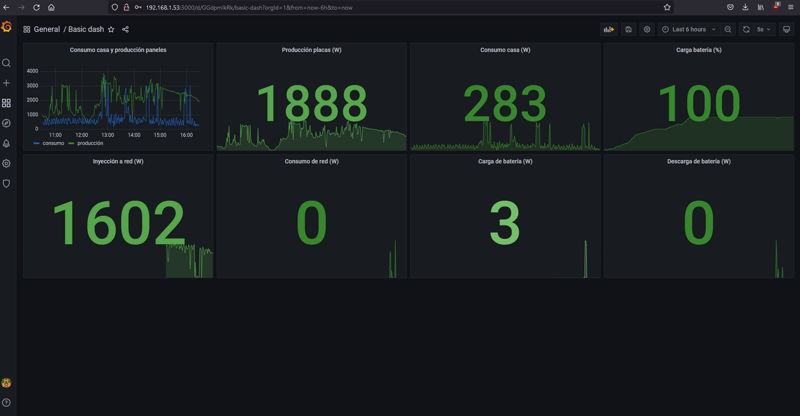

# sonnenBatterie-publisher

Publish in influxdb and display in grafana the information about the sonnen battery

This project has been developed to run on a raspberry. That is why an old version of influxdb is used, since as of 2.0 a 64-bit architecture is necessary, which raspberry 3 is not. If you want to use it with another server, I advise you to change the influxdb image to latest.

All is tested with sonnenbatterie 10 + raspberry pi 3 b with raspberry os lite

## configuration
application env vars are:
- BATTERY_ADDRESS
- BATTERY_AUTH_KEY
- INFLUX_URL
- INFLUX_AUTH
- INFLUX_BUCKET (optional, default value is 'battery')
- FREQUENCY_UPDATE (optional, default is 5 seconds)

if you want to use the docker-compose, just modify the .env file with these values:
- BATTERY_ADDRESS
- BATTERY_AUTH_KEY
- INFLUX_USERNAME
- INFLUX_PASSWORD
- INFLUX_AUTH (for newest versions of influxdb, use token instead of user:password)
- INFLUX_BUCKET

## deploy on raspberry

docker-compose file is setup for work on raspberry
steps:
- install 'raspberry os lite' on your raspberry (Raspberry Pi Imager)
- ssh connect or GUI using hdmi if you prefer, open terminal
- install docker : $ curl -fsSL https://get.docker.com | sh
- modify .env file with your desired values
- $ docker compose up -d
- go to http://host:3000 and login grafana (admin:admin)
- add influxdb as a datasource. The url is http://influx:8086 and user:password and database is in .env file
- create your dashboard or import mine

## my dashboard

## generate auth token for your sonnen battery

- go to your battery dashboard
- option Software-Integration
- on JSON API, just enable the Read API and copy the token 

## motivation

my main motivation is to use a familiar tool like grafana, with a good history, to monitor my electrical network. The tool offered by sonnen is very competent, and without its API this project would not have been born, but I miss a little more depth
